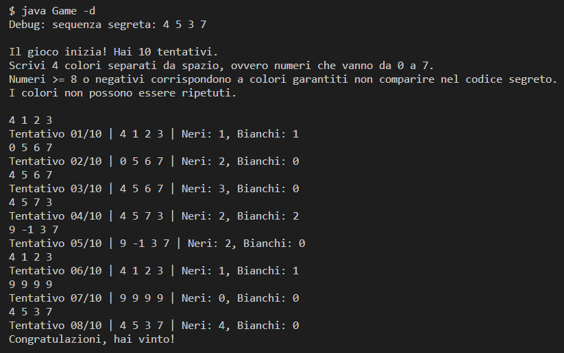

# MasterMind
Progetto per il primo anno di Matematica Applicata UniVr.

Quanto segue è un'implementazione in Java delle regole del gioco MasterMind secondo [questo sito](http://www.webgamesonline.com/mastermind/rules.php).

Lo scopo del progetto è mostrare l'utilizzo della [programmazione ad oggetti](https://it.wikipedia.org/wiki/Programmazione_orientata_agli_oggetti) per la creazione in squadra di un gioco scelto dal gruppo.

## Installazione
- Scaricare il progetto tramite `git clone`
- Compilare tramite `javac Game.java` (Ovviamente serve la Java JDK)
- Eseguire il progetto tramite `java Game` + comandi opzionali

## Lista comandi
Comandi da fornire al programma, ad esempio se il comando è `--help`, il programma deve essere eseguito tramite `java Game --help` 

### Debug
Inserendo l'opzione `-d` o `--debug` verrà scritta anche la sequenza segreta all'inizio del gioco

### Settings
Inserendo l'opzione `-s` o `--settings` si potranno inserire le opzioni da terminale, che vengono salvate sul file `config.txt` per essere considerate nella prossima esecuzione

### Help
Inserendo l'opzione `-h` o `--help` verrà scritto su `stdout` il link del progetto (su Github).

## Gioco
Le impostazioni di default prevedono:
- 10 tentativi
- 4 colori da indovinare in ordine
- 8 possibili colori scelti dall'algoritmo
- Nessuna ripetizione nei colori scelti
  
Ad ogni tentativo bisogna indovinare la sequenza segreta, inserendo una serie di numeri che corrispondono ai colori possibili (Durante il gioco vengono specificate le impostazioni correnti).
Ad ogni tentativo verrà scritto i numeri di pallini, i quali corrispondo rispettivamente a:

- Neri: hai indovinato N colori alla posizione giusta
- Bianchi: hai indovinato N colori alla posizione sbagliata

Vinci se indovini la sequenza segreta nel numero di tentativi a disposizione.

